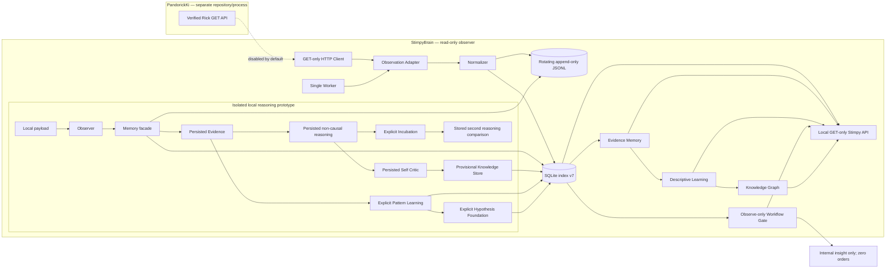

# Architecture

There is no edge from Stimpy back to Pandorick. The HTTP client exposes GET only and accepts loopback HTTP base URLs only. Raw observation nodes are not added to the architecture graph.

The prototype is deliberately not connected to the worker, HTTP polling, broker, Telegram or any order path. Evidence, Reasoning and Critic records are immutable-by-ID SQLite projections linked to observations. Incubation persists both reasoning identities and comparison deltas. Pattern Learning links independent Observation/Evidence cases. The Hypothesis Lab stores bounded research questions, append-only supporting/contradicting/neutral evidence, idempotent evaluations, Hypothesis-specific Reasoning/Critic records and evidence-gated incubation. These services advance only through explicit calls; there is no background scheduler or automatic strategy change.
