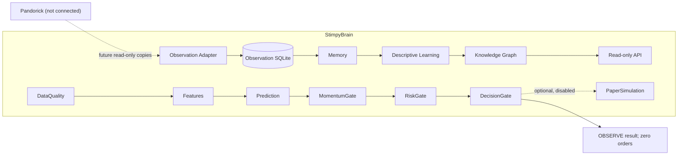

# Architecture

```mermaid
flowchart LR
  P["Pandorick (not connected)"] -. "future read-only copies" .-> A[Observation Adapter]
  subgraph S[StimpyBrain]
    A --> O[(Observation SQLite)] --> M[Memory] --> L[Descriptive Learning] --> K[Knowledge Graph] --> API[Read-only API]
    DQ[DataQuality] --> F[Features] --> PR[Prediction] --> MG[MomentumGate] --> RG[RiskGate] --> DG[DecisionGate]
    DG -. "optional, disabled" .-> PS[PaperSimulation]
  end
  DG --> X["OBSERVE result; zero orders"]
```

All arrows are internal reads/appends. There is no return write path to Pandorick and no broker or outbound messaging component.
