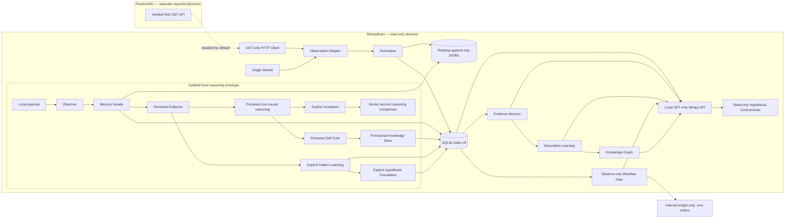

# Architecture

There is no edge from Stimpy back to Pandorick. The HTTP client exposes GET only and accepts loopback HTTP base URLs only. Raw observation nodes are not added to the architecture graph.

Shitzo S.2 remains disconnected inside Stimpy: `caller-supplied validated data -> PriceWindow -> frozen FeatureSnapshot -> virtual PaperBroker -> ShitzoRepository`. The PaperBroker has no network client and can mutate only virtual SQLite accounts/positions. There is no concrete feed provider, trader, worker, Evidence bridge or HTTP API edge.

The prototype is deliberately not connected to the worker, HTTP polling, broker, Telegram or any order path. The Hypothesis Controlcenter reads bounded same-origin API projections and has no forms or write calls. Its static assets are served with a restrictive Content Security Policy. Reject/archive commands remain explicit local Python calls. There is no background scheduler or automatic strategy change.
