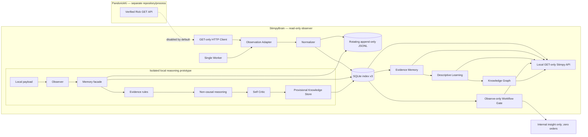

# Architecture

There is no edge from Stimpy back to Pandorick. The HTTP client exposes GET only and accepts loopback HTTP base URLs only. Raw observation nodes are not added to the architecture graph.

The prototype is deliberately not connected to the worker, HTTP polling, broker, Telegram or any order path. Its `IncubationPort` is only a typed future boundary; there is no scheduler or automatic reactivation.
